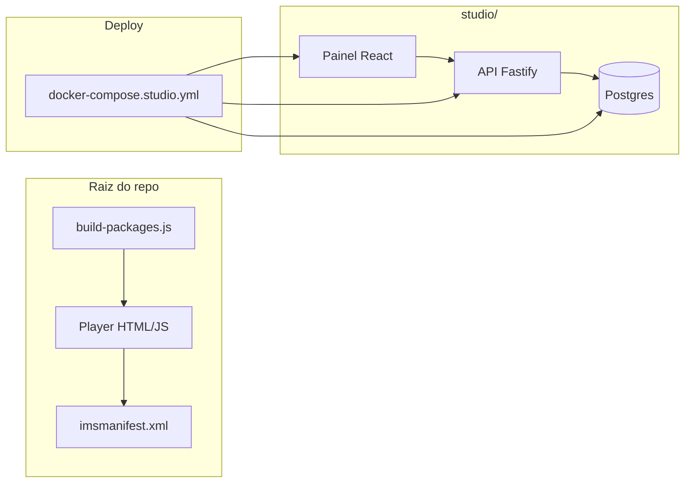

# UniCV — Player SCORM + Studio (VPS)

Player de videoaulas em formato SCORM 1.2 (Moodle) com vitrines Vimeo, progresso e temas. Inclui **UniCV Studio**: painel para conectar Vimeo (OAuth), gerenciar vitrines, exportar HTML/SCORM/iframe e integrar via LTI 1.3 / xAPI.

## Conteúdo do repositório

- **Raiz**: player estático (HTML/JS), `index.html`, `imsmanifest.xml`, `builder.html` e script de pacotes SCORM (`build-packages.js`).
- **studio/api**: API Node (Fastify + Prisma) — OAuth Vimeo, vitrines, playlist, export, LTI, xAPI.
- **studio/web**: Painel React (Vite) para administrar vitrines e exportações.
- **Deploy**: `docker-compose.studio.yml` para rodar db + api + web.



## Documentação — onde encontrar

| Objetivo | Documento |
|----------|-----------|
| Player (arquitetura, fluxo, configuração, SCORM) | [DOCUMENTACAO.md](DOCUMENTACAO.md) |
| Studio (API + painel, endpoints, LTI) | [studio/README.md](studio/README.md) |
| Deploy (Docker, variáveis) | [studio/DEPLOY.md](studio/DEPLOY.md) |
| Variáveis de ambiente | [.env.studio.example](.env.studio.example) |
| Índice completo da documentação | [docs/README.md](docs/README.md) |

## Antes de commitar

- **Não commite** arquivos `.env` com chaves ou senhas (use [.env.studio.example](.env.studio.example) como referência).
- Rode `git status` e confira se não há `studio/.env`, `.env` ou arquivos sensíveis listados.

## Build local e Docker

```bash
# Pacotes SCORM em lote (requer Node e archiver)
npm install
node build-packages.js disciplinas.csv

# Studio (API + painel)
npm run studio:dev          # API em http://localhost:3001
npm run studio:web:dev       # Painel em http://localhost:3000

# Tudo com Docker (raiz do repo)
docker compose -f docker-compose.studio.yml up -d
```

## Publicar imagens no Docker Hub

Configure no GitHub (Settings → Secrets and variables → Actions) os secrets:

- `DOCKERHUB_USERNAME`: seu usuário do Docker Hub  
- `DOCKERHUB_TOKEN`: token de acesso (Access Tokens no Docker Hub)

Depois crie e envie uma tag para disparar o workflow:

```bash
git tag v1.0.0
git push origin v1.0.0
```

As imagens serão publicadas como `DOCKERHUB_USERNAME/unicv-studio-api` e `DOCKERHUB_USERNAME/unicv-studio-web`. Detalhes em [studio/DEPLOY.md](studio/DEPLOY.md).
